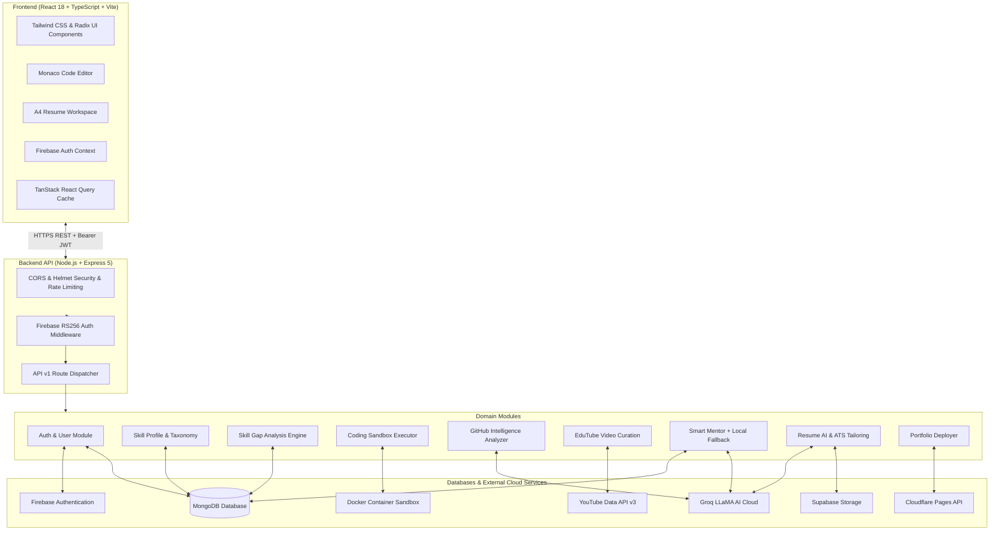
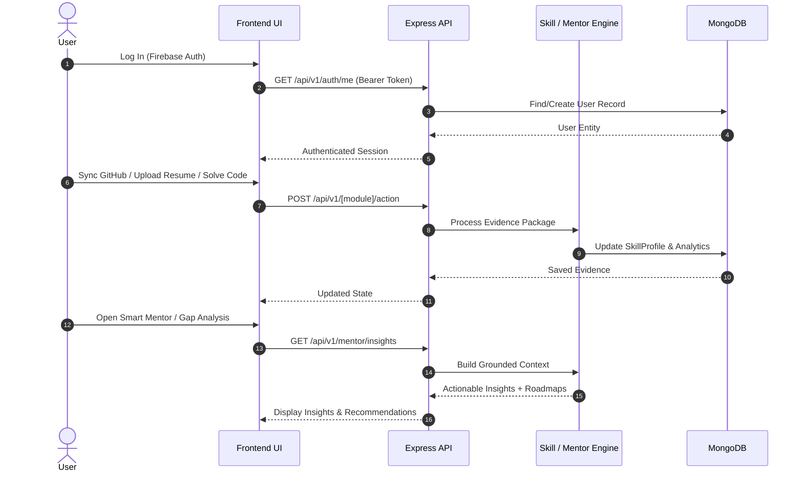

# Smart Skill Hub (SSH)

> **AI-Powered Developer Intelligence, Learning, Career Acceleration & Portfolio Platform**

[](https://react.dev/)
[](https://www.typescriptlang.org/)
[](https://vitejs.dev/)
[](https://tailwindcss.com/)
[](https://nodejs.org/)
[](https://expressjs.com/)
[](https://www.mongodb.com/)
[](https://firebase.google.com/)
[](https://groq.com/)
[](https://www.docker.com/)

---

## 📑 Table of Contents
1. [Project Overview](#1-project-overview)
2. [Why Smart Skill Hub](#2-why-smart-skill-hub)
3. [Core Features](#3-core-features)
4. [Platform Architecture](#4-platform-architecture)
5. [System Architecture Diagram](#5-system-architecture-diagram)
6. [Feature Modules](#6-feature-modules)
7. [AI Architecture](#7-ai-architecture)
8. [Authentication Architecture](#8-authentication-architecture)
9. [GitHub Integration](#9-github-integration)
10. [EduTube Learning System](#10-edutube-learning-system)
11. [Smart Mentor](#11-smart-mentor)
12. [Skill Profile](#12-skill-profile)
13. [Skill Gap Analysis](#13-skill-gap-analysis)
14. [Learning Roadmap](#14-learning-roadmap)
15. [Coding Assessment](#15-coding-assessment)
16. [Resume AI](#16-resume-ai)
17. [Portfolio System](#17-portfolio-system)
18. [Analytics](#18-analytics)
19. [Settings & Integrations](#19-settings--integrations)
20. [User Data Flow](#20-user-data-flow)
21. [Frontend + Backend Architecture](#21-frontend--backend-architecture)
22. [Technology Stack](#22-technology-stack)
23. [Project Structure](#23-project-structure)
24. [Environment Variables](#24-environment-variables)
25. [Local Development Setup](#25-local-development-setup)
26. [Running Frontend](#26-running-frontend)
27. [Running Backend](#27-running-backend)
28. [Testing](#28-testing)
29. [Production Build](#29-production-build)
30. [Deployment](#30-deployment)
31. [Security](#31-security)
32. [API Overview](#32-api-overview)
33. [AI Fallback Architecture](#33-ai-fallback-architecture)
34. [GitHub OAuth](#34-github-oauth)
35. [Database Architecture](#35-database-architecture)
36. [Future Improvements](#36-future-improvements)
37. [Contribution Guidelines](#37-contribution-guidelines)
38. [License](#38-license)

---

## 1. Project Overview

**Smart Skill Hub (SSH)** is a comprehensive, production-grade engineering platform designed to bridge the gap between technical skill development, verifiable coding competency, and career advancement. It combines developer intelligence, automated repository analysis, sandboxed coding execution, curated video learning, AI-powered career coaching, and ATS-optimized resume/portfolio engineering into a unified cloud workspace.

Detailed module documentation is organized into dedicated subsystem READMEs:
- 🌐 **Frontend Subsystem**: [./frontend/README.md](./frontend/README.md)
- ⚙️ **Backend Subsystem**: [./backend/README.md](./backend/README.md)

---

## 2. Why Smart Skill Hub

Aspiring engineers and technical professionals often navigate fragmented workflows:
- **Resumes** live in static document editors disconnected from actual GitHub activity.
- **Skill profiles** rely on self-reported keywords rather than empirical execution evidence.
- **Learning resources** across YouTube and course platforms are disjointed from identified skill gaps.
- **Coding practice** occurs in isolated algorithm portals without connecting back to an engineer's master skill taxonomy.

**Smart Skill Hub** solves these pain points by integrating code evaluation, repository mining, contextual learning, and resume engineering into one unified feedback loop.

---

## 3. Core Features

- 📄 **Master Profile & ATS Resume Tailoring**: Multi-format resume parsing (PDF, DOCX, TXT, OCR) with ATS keyword optimization and interactive A4 rendering.
- 🔍 **GitHub Repository Intelligence**: Automated repository metrics, commit velocity analysis, demonstrated skill extraction, and complexity scoring.
- 💻 **Docker-Sandboxed Coding Assessments**: In-browser Monaco editor with isolated Docker Node execution, multi-case evaluation, and memory/CPU limits.
- 📺 **EduTube Skill-Mapped Video Discovery**: Intelligent video curation via YouTube Data API v3 mapped directly to user skill gaps.
- 🎯 **Canonical Skill Taxonomy & Gap Analysis**: Industry-aligned role benchmarks (Full Stack, Backend, Frontend, DevOps, AI Engineer) comparing user skills against role requirements.
- 🤖 **Smart AI Mentor**: Real-time conversational AI coaching powered by Groq LLaMA models with a deterministic local rule/NLP fallback.
- 📊 **Developer & Admin Analytics**: Split analytics interface separating personal developer trajectory metrics from aggregate administrative insights.
- 🌐 **Portfolio Generator & Cloudflare Publishing**: Automated developer web portfolio generation with one-click deployment to Cloudflare Pages.

---

## 4. Platform Architecture

The platform follows a decoupled, service-oriented client-server architecture:
- **Client Layer**: Single Page Application (SPA) built with React 18, TypeScript, and Vite, utilizing TanStack Query for caching and Tailwind CSS for styling.
- **API Gateway & Business Layer**: Node.js & Express 5 REST API organized into modular domain modules (`coding`, `edutube`, `gaps`, `github`, `mentor`, `recommendations`, `resume`, `settings`, `skills`).
- **Data Persistence**: MongoDB with Mongoose schemas enforcing authenticated user isolation.
- **Execution Sandbox**: Dockerode daemon managing temporary isolated containers with non-root UID execution, tmpfs mounts, CPU throttling, and p-limit execution concurrency.
- **External Services**: Firebase Authentication (RS256 JWT tokens), Supabase Storage (resume assets), Groq Cloud (LLM inference), and Cloudflare Pages API.

---

## 5. System Architecture Diagram



---

## 6. Feature Modules

| Module | Core Purpose | Primary Tech / Dependencies |
|---|---|---|
| **Auth & Profile** | User registration, login, profile synchronization, data isolation | Firebase Auth, `jsonwebtoken`, `jwks-rsa` |
| **Coding Assessment** | Algorithm practice, sandboxed code runner, DSA validation | Monaco Editor, Dockerode, `p-limit` |
| **EduTube** | Targeted video discovery for closing skill gaps, playlists, history | YouTube Data API v3, React Player |
| **GitHub Intelligence** | Repository mining, commit frequency, demonstrated skills | GitHub REST API, Groq AI |
| **Skill Taxonomy & Gaps** | Role benchmarks, gap severity scores, roadmaps | Canonical Skill Engine, Recharts |
| **Smart Mentor** | Interactive AI career mentor, actionable advice | Groq LLaMA, Rule/NLP Fallback |
| **Resume AI** | Multi-format resume parsing, ATS job description tailoring | `pdf-parse`, `mammoth`, `tesseract.js`, Groq |
| **Portfolio System** | One-click developer portfolio publishing to Cloudflare | Cloudflare Pages Direct Upload API |
| **Analytics** | Personal developer growth and platform administrative metrics | MongoDB Aggregation, Recharts |

---

## 7. AI Architecture

Smart Skill Hub uses high-throughput Large Language Models via the **Groq SDK** (`@langchain/groq`, `groq-sdk`) utilizing models such as `openai/gpt-oss-120b`, `openai/gpt-oss-20b`, and `qwen/qwen3.6-27b`.

AI is utilized for:
1. **Resume Tailoring**: Analyzing job requirements and rewriting experience bullets for ATS keyword alignment.
2. **GitHub Summarization**: Extracting architecture patterns and code quality insights from repositories.
3. **Smart Mentor**: Context-grounded technical coaching incorporating the user's live resume, coding scores, and GitHub metrics.

---

## 8. Authentication Architecture

1. **Client**: Authenticates via Firebase Authentication (Email/Password or OAuth).
2. **ID Token**: Firebase generates a signed RS256 JWT on the client.
3. **API Request**: Frontend attaches token in the `Authorization: Bearer <token>` header.
4. **Backend Verification**: Backend downloads and caches Google's public keys (`jwks-rsa`) and verifies the signature, audience (`FIREBASE_PROJECT_ID`), and expiration.
5. **Data Ownership**: The decoded `sub`/`uid` is mapped to the internal MongoDB User document, ensuring all queries filter by `{ owner: req.user._id }`.

---

## 9. GitHub Integration

The platform allows connecting a GitHub profile through an OAuth integration flow:
```
User -> Authorize GitHub -> GitHub OAuth Callback -> Access Token -> Synchronize Repositories -> Analyze Code & Commits -> Extract Verified Skill Evidence -> Feed to Smart Mentor & Skill Profile
```
*Note: GitHub client secrets are strictly maintained server-side and never exposed to clients.*

---

## 10. EduTube Learning System

EduTube integrates curated technical education into the developer workspace:
- Queries the **YouTube Data API v3** using targeted search strings based on detected skill gaps.
- Provides search filters (duration, upload date, topic category).
- Supports bookmarking saved videos, tracking watch history, and building custom playlists.

---

## 11. Smart Mentor

Smart Mentor acts as a personal AI technical career advisor:
- **Grounded Context**: Aggregates verified data from the user's profile (target role, skill gaps, GitHub repositories, and coding test scores).
- **Proactive Insights**: Highlights missing repository READMEs, unverified top skills, and high-priority action items.
- **Reliable Fallback**: If Groq API credentials are unset or the cloud API is unreachable, the system automatically falls back to a deterministic local rule & NLP engine.

---

## 12. Skill Profile

The Skill Profile engine manages canonical skill representations:
- Normalizes variations (e.g., `react.js`, `reactjs`, `React` → `React`).
- Tracks skill tiers (`Beginner`, `Intermediate`, `Advanced`, `Expert`).
- Assigns confidence ratings based on multiple evidence streams: self-reported, resume extracted, GitHub repository analyzed, and sandboxed coding verified.

---

## 13. Skill Gap Analysis

Compares the candidate's verified skills against industry role benchmarks:
- Evaluates missing skills, under-leveled skills, and verified strengths.
- Calculates an aggregate **Role Readiness Score** (0–100%).
- Renders visual radar charts and categorical gap breakdown tables.

---

## 14. Learning Roadmap

Generates prioritized, step-by-step roadmaps:
- Broken down into phases (Fundamentals, Core Development, Production Readiness).
- Links directly to EduTube video tutorials and practical coding challenges.
- Tracks completion status per learning objective.

---

## 15. Coding Assessment

Interactive DSA and algorithmic practice module:
- **Catalog**: Core data structures, algorithms, array manipulation, string parsing.
- **Safety**: Code runs in isolated Docker containers with no internet access, restricted UID (1000), read-only root filesystems, and strict memory/timeout limits.
- **Verification**: Evaluates test cases and returns execution time, stdout, stderr, and pass/fail evidence.

---

## 16. Resume AI

Complete master profile and resume building toolset:
- **Extraction**: Upload PDF, DOCX, TXT, or scanned images (OCR via `tesseract.js`).
- **Tailoring**: Paste target job description to compute keyword match percentage and receive AI-optimized bullet suggestions.
- **Preview & Export**: Real-time rendering of ATS-compatible A4 templates with client-side PDF export.

---

## 17. Portfolio System

Automated developer portfolio generator:
- Select from curated templates highlighting projects, skills, and experience.
- Generates clean static HTML/CSS/JS bundles.
- Deploys directly to **Cloudflare Pages** via API token or exports as a downloadable ZIP.

---

## 18. Analytics

- **Personal Developer Analytics**: Visualizes coding assessment trajectory, gap closure velocity, and platform activity over time.
- **Admin Analytics**: System dashboard providing aggregated metrics (total registered users, API request rates, module usage breakdown, and daily active statistics).

---

## 19. Settings & Integrations

Centralized user configuration dashboard:
- Profile management (name, headline, bio, avatar).
- Connected accounts (GitHub OAuth linkage and repository synchronization).
- Notification preferences, appearance controls (Light / Dark / System mode), and privacy export tools.

---

## 20. User Data Flow



---

## 21. Frontend + Backend Architecture

- **Frontend**: Built with modular features under `frontend/src/modules/` with shared primitives in `frontend/src/components/ui/`. State is managed via React Context (`AuthContext`) and TanStack React Query.
- **Backend**: Built with Express 5 under `backend/src/modules/` featuring clean separation between route definitions, request validation, controller handlers, and business services.

---

## 22. Technology Stack

| Domain | Technology | Purpose |
|---|---|---|
| **Frontend Framework** | React 18.3 | Core UI library |
| **Language** | TypeScript 5.8 / JavaScript ES Modules | Type safety and execution |
| **Build Tool** | Vite 5.4 | Bundler and dev server |
| **Styling** | Tailwind CSS 3.4 & PostCSS | Utility-first responsive design |
| **UI Components** | Radix UI Primitives & Lucide React | Accessible UI widgets and iconography |
| **Code Editor** | `@monaco-editor/react` | In-browser coding assessment editor |
| **Data Visualization** | Recharts 2.15 | Skill gap and analytics chart rendering |
| **Backend Runtime** | Node.js 18+ (Express 5.1) | REST API and middleware server |
| **Database** | MongoDB & Mongoose 8.18 | Document storage and indexing |
| **Authentication** | Firebase Admin SDK & `jwks-rsa` | RS256 JWT validation |
| **AI Inference** | Groq SDK (`groq-sdk`, `@langchain/groq`) | High-speed LLM processing |
| **Storage** | `@supabase/supabase-js` | Resume and document asset storage |
| **Container Sandbox** | Dockerode 5.0 | Secure sandboxed algorithm execution |
| **Unit & Integration Tests**| Vitest 3.2, Supertest 7.1, React Testing Library | Automated test execution |

---

## 23. Project Structure

```text
SSH_integrated_Project/
├── backend/                      # Node.js Express Backend
│   ├── src/
│   │   ├── config/               # Environment & Groq configuration
│   │   ├── constants/            # Skill taxonomy & role benchmarks
│   │   ├── controllers/          # API route controllers
│   │   ├── core/                 # Auth middleware, DB connection, error handling
│   │   ├── db/                   # MongoDB connection management
│   │   ├── middlewares/          # Auth, analytics, and error handling
│   │   ├── models/               # Mongoose data schemas
│   │   ├── modules/              # Domain modules (coding, edutube, github, mentor, etc.)
│   │   ├── routes/               # Express API v1 endpoints
│   │   ├── services/             # AI, parsing, Docker sandbox, and external integrations
│   │   └── utils/                # Storage, formatting, and helper utilities
│   ├── tasks/                    # DSA assessment task catalog (JavaScript)
│   ├── test/                     # Vitest integration and security verification suite
│   ├── .env.example              # Backend environment template
│   ├── package.json
│   ├── vitest.config.js          # Backend test configuration
│   └── README.md                 # Backend detailed documentation
│
├── frontend/                     # React 18 + Vite Frontend
│   ├── src/
│   │   ├── components/           # Reusable UI primitives, landing components, resume viewers
│   │   ├── core/                 # Core authentication & API client services
│   │   ├── contexts/             # Auth and global state contexts
│   │   ├── lib/                  # Utilities, API client, Firebase helpers
│   │   ├── modules/              # Domain components (coding, edutube, github, mentor, etc.)
│   │   ├── pages/                # Application routes and views
│   │   ├── styles/               # Custom styling and design tokens
│   │   ├── test/                 # Frontend component & integration tests
│   │   ├── App.tsx               # Root application router
│   │   └── main.tsx              # Application entry point
│   ├── .env.example              # Frontend environment template
│   ├── index.html
│   ├── package.json
│   ├── vite.config.ts
│   ├── vitest.config.ts          # Frontend test configuration
│   └── README.md                 # Frontend detailed documentation
│
├── render.yaml                   # Cloud deployment manifest
├── LICENSE                       # MIT License
├── .gitignore                    # Git exclude configuration
└── README.md                     # Root project documentation
```

---

## 24. Environment Variables

### Backend Configuration (`backend/.env`)

| Variable | Description | Example / Default |
|---|---|---|
| `PORT` | Backend HTTP listening port | `8000` |
| `NODE_ENV` | Runtime environment | `development` / `production` |
| `API_PREFIX` | Base prefix for all API routes | `/api/v1` |
| `CORS_ORIGIN` | Allowed CORS origins (comma-separated or `*`) | `*` |
| `MONGODB_URI` | MongoDB connection string | `mongodb://localhost:27017/smartskillhub` |
| `FIREBASE_PROJECT_ID`| Firebase Project ID for auth token verification | `smart-skill-hub` |
| `SUPABASE_URL` | Supabase project endpoint URL | `https://your-project.supabase.co` |
| `SUPABASE_SERVICE_ROLE_KEY` | Supabase service key for bucket storage | `your_service_role_key` |
| `SUPABASE_STORAGE_BUCKET` | Supabase bucket name for resume uploads | `resumes` |
| `GROQ_API_KEY` | Groq Cloud API key for LLM inference | `your_groq_api_key` |
| `GROQ_MODEL` | Groq model identifier | `openai/gpt-oss-120b` |
| `YOUTUBE_API_KEY` | Google Cloud YouTube Data API v3 key | `your_youtube_api_key` |
| `CF_ACCOUNT_ID` | (Optional) Cloudflare Account ID | `your_cloudflare_account_id` |
| `CF_API_TOKEN` | (Optional) Cloudflare Pages API Token | `your_cloudflare_api_token` |
| `GITHUB_CLIENT_ID` | (Optional) GitHub OAuth Client ID | `your_github_client_id` |
| `GITHUB_CLIENT_SECRET` | (Optional) GitHub OAuth Client Secret | `your_github_client_secret` |

### Frontend Configuration (`frontend/.env`)

| Variable | Description | Example / Default |
|---|---|---|
| `VITE_API_URL` | Base URL pointing to the Backend API v1 | `http://localhost:8000/api/v1` |
| `VITE_FIREBASE_API_KEY` | Firebase Web API Key | `your_firebase_api_key` |
| `VITE_FIREBASE_AUTH_DOMAIN` | Firebase Auth Domain | `smart-skill-hub.firebaseapp.com` |
| `VITE_FIREBASE_PROJECT_ID` | Firebase Project ID | `smart-skill-hub` |
| `VITE_FIREBASE_MESSAGING_SENDER_ID` | Firebase Cloud Messaging Sender ID | `your_messaging_sender_id` |
| `VITE_FIREBASE_APP_ID` | Firebase Web Application ID | `your_firebase_app_id` |
| `VITE_FIREBASE_MEASUREMENT_ID` | Firebase Analytics Measurement ID | `your_measurement_id` |

---

## 25. Local Development Setup

### Prerequisites
- **Node.js**: v18.0.0 or higher
- **npm**: v9.0.0 or higher
- **MongoDB**: Local MongoDB server or MongoDB Atlas cluster
- **Docker**: (Optional) Installed and running for executing coding assessments locally

---

## 26. Running Frontend

```bash
# Navigate to frontend directory
cd frontend

# Install dependencies
npm install

# Copy example environment configuration
cp .env.example .env

# Start development server
npm run dev
```
The frontend will start at `http://localhost:5173`.

---

## 27. Running Backend

```bash
# Navigate to backend directory
cd backend

# Install dependencies
npm install

# Copy example environment configuration
cp .env.example .env

# Start development server with nodemon
npm run dev
```
The backend API will start at `http://localhost:8000`.

---

## 28. Testing

### Run Backend Tests (Vitest)
```bash
cd backend
npm test
```
*Executes all 29 test suites (244 tests) including integration, Docker sandbox security verification, and route security tests.*

### Run Frontend Tests (Vitest)
```bash
cd frontend
npm test
```
*Executes all 20 test suites (147 tests) including component rendering, route protection, and state management tests.*

---

## 29. Production Build

### Build Frontend
```bash
cd frontend
npm run build
```
Generates production-optimized static assets in `frontend/dist`.

---

## 30. Deployment

- **Frontend**: Ready for deployment on Vercel, Netlify, or Cloudflare Pages (`frontend/dist`).
- **Backend**: Configured for deployment on Render, Railway, or VPS hosting using `render.yaml`.
- **Database**: MongoDB Atlas.

---

## 31. Security

- **Token-Based Isolation**: Every request requires a valid RS256 Firebase JWT token validated directly against Google JWKS endpoints.
- **Tenant Data Isolation**: All database queries enforce `{ owner: req.user._id }` scoping.
- **Docker Execution Sandbox**: Sandboxed code runs as non-root UID (1000), read-only root filesystems, blocked outbound network sockets, restricted tmpfs directories, and capped memory (128MB) & CPU (0.5).
- **HTTP Hardening**: Helmet security headers, CORS origin whitelisting, express rate limiting, and size-bounded body parsing.

---

## 32. API Overview

All API endpoints are prefixed with `/api/v1`.

| Module | Route Prefix | Key Endpoints | Auth Required |
|---|---|---|---|
| **Healthcheck** | `/api/v1/healthcheck` | `GET /` | No |
| **Auth** | `/api/v1/auth` | `POST /firebase/sign-in`, `GET /me`, `PUT /profile` | Yes (Bearer JWT) |
| **Skills** | `/api/v1/skills` | `GET /profile`, `POST /evaluate`, `GET /history` | Yes |
| **Gaps** | `/api/v1/gaps` | `GET /target-roles`, `GET /analysis`, `POST /analyze` | Yes |
| **Roadmap** | `/api/v1/recommendations` | `GET /roadmap`, `POST /generate` | Yes |
| **Coding** | `/api/v1/coding` | `GET /tasks`, `GET /tasks/:taskId`, `POST /submit` | Yes (for submit) |
| **GitHub** | `/api/v1/github` | `GET /analysis`, `POST /analyze`, `POST /sync` | Yes |
| **EduTube** | `/api/v1/edutube` | `GET /search`, `GET /recommendations`, `GET /saved` | Yes |
| **Mentor** | `/api/v1/mentor` | `GET /insights`, `POST /chat`, `GET /context` | Yes |
| **Resumes** | `/api/v1/resumes` | `GET /`, `POST /`, `POST /upload`, `POST /tailor` | Yes |
| **Portfolios** | `/api/v1/portfolio` | `POST /generate`, `POST /deploy` | Yes |
| **Analytics** | `/api/v1/analytics` | `GET /personal`, `GET /metrics` | Yes |
| **Admin** | `/api/v1/admin` | `GET /stats`, `GET /users` | Yes (Admin Role) |

*For complete endpoint documentation, parameters, and payloads, see [./backend/README.md](./backend/README.md).*

---

## 33. AI Fallback Architecture

To ensure high availability and offline resilience:
1. **Primary**: Prompts are dispatched to the Groq Cloud API with structured JSON schemas.
2. **Fallback Engine**: If `GROQ_API_KEY` is not configured, rate limits are reached, or network errors occur, Smart Mentor gracefully switches to an internal **Deterministic Local Rule & NLP Engine** (`smart-mentor-local.service.js`).
3. **Transparency**: The response object contains a metadata flag (`provider: "groq"` vs `provider: "local-fallback"`) so the user understands the source of recommendations.

---

## 34. GitHub OAuth

The GitHub OAuth flow securely links developer identities:
1. User clicks "Connect GitHub" in Settings.
2. Frontend redirects to GitHub authorization page.
3. GitHub redirects back with a temporary authorization code.
4. Backend securely exchanges code for an access token via server-to-server POST request.
5. Backend stores encrypted access token linked to the user document and begins asynchronous repository analysis.

---

## 35. Database Architecture

MongoDB schemas are organized around user-centric data models:
- `User`: Base identity, role, profile details, and connected services.
- `SkillProfile`: Canonical verified skill inventory with confidence ratings.
- `AssessmentSession`: Coding assessment submissions, test outcomes, and execution runtimes.
- `GitHubAnalysis`: Repository metadata, commit velocity, and language distribution.
- `Resume`: Parsed work experience, education, projects, and tailored versions.
- `EduTubeHistory` & `EduTubeSaved`: Learning progress and bookmarked videos.
- `SmartMentorConversation`: Chat history and grounded advisory context.
- `Analytics`: Daily platform counters and personal engagement telemetry.

---

## 36. Future Improvements

- [ ] Support for Python, Java, and C++ in the sandboxed coding runner.
- [ ] Multi-user coding interview rooms with WebRTC audio/video.
- [ ] Direct export to LinkedIn profile certifications via API.
- [ ] Automated weekly skill summary digests delivered via email.

---

## 37. Contribution Guidelines

1. Fork the repository.
2. Create a feature branch (`git checkout -b feature/amazing-feature`).
3. Commit your changes with conventional commit messages (`git commit -m "feat: add amazing feature"`).
4. Verify all tests pass (`npm test` in both frontend and backend).
5. Push to the branch (`git push origin feature/amazing-feature`).
6. Open a Pull Request.

---

## 38. License

This project is open source and available under the [MIT License](LICENSE).
