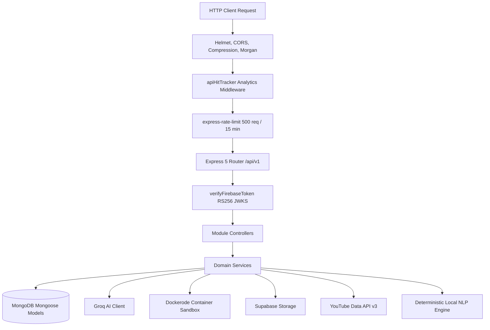

# Smart Skill Hub Backend

> **Node.js & Express 5 Modular REST API Engine for Smart Skill Hub**

[](https://nodejs.org/)
[](https://expressjs.com/)
[](https://www.mongodb.com/)
[](https://firebase.google.com/)
[](https://groq.com/)
[](https://www.docker.com/)

---

## 📑 Table of Contents
1. [Backend Overview](#1-backend-overview)
2. [Backend Responsibilities](#2-backend-responsibilities)
3. [Architecture](#3-architecture)
4. [Express Application Structure](#4-express-application-structure)
5. [API Versioning](#5-api-versioning)
6. [Route Architecture](#6-route-architecture)
7. [Controllers](#7-controllers)
8. [Services](#8-services)
9. [Models](#9-models)
10. [Middleware](#10-middleware)
11. [Authentication](#11-authentication)
12. [Firebase Authentication](#12-firebase-authentication)
13. [Email/Password Verification](#13-emailpassword-verification)
14. [GitHub OAuth](#14-github-oauth)
15. [GitHub Intelligence](#15-github-intelligence)
16. [EduTube](#16-edutube)
17. [Smart Mentor](#17-smart-mentor)
18. [Groq AI Integration](#18-groq-ai-integration)
19. [Local NLP Fallback](#19-local-nlp-fallback)
20. [Skill Profile](#20-skill-profile)
21. [Skill Gap Analysis](#21-skill-gap-analysis)
22. [Learning Roadmap](#22-learning-roadmap)
23. [Coding Assessment](#23-coding-assessment)
24. [Resume Processing](#24-resume-processing)
25. [Portfolio](#25-portfolio)
26. [Analytics](#26-analytics)
27. [Settings / Integrations](#27-settings--integrations)
28. [MongoDB Architecture](#28-mongodb-architecture)
29. [Data Ownership & Isolation](#29-data-ownership--isolation)
30. [Error Handling](#30-error-handling)
31. [Rate Limiting](#31-rate-limiting)
32. [API Security](#32-api-security)
33. [Environment Variables](#33-environment-variables)
34. [API Endpoint Reference](#34-api-endpoint-reference)
35. [Testing](#35-testing)
36. [Development](#36-development)
37. [Production](#37-production)
38. [Deployment](#38-deployment)
39. [Backend Project Structure](#39-backend-project-structure)
40. [Future Improvements](#40-future-improvements)

---

## 1. Backend Overview

The **Smart Skill Hub Backend** is a high-performance REST API built on Node.js and Express 5. It orchestrates user authentication, MongoDB persistence, Groq AI LLM inference, sandboxed Docker execution for coding assessments, YouTube Data API video discovery, and resume text extraction.

For root system documentation, see [../README.md](../README.md).  
For frontend documentation, see [../frontend/README.md](../frontend/README.md).

---

## 2. Backend Responsibilities

- **Authentication & JWT Verification**: Validates Firebase RS256 ID tokens against Google JWKS public keys and associates requests with MongoDB user documents.
- **Sandboxed Execution Engine**: Manages isolated Docker containers for executing algorithmic code safely with strict resource bounds.
- **Skill Taxonomy & Gap Engine**: Normalizes extracted skills, benchmarks against role definitions, and calculates readiness scores.
- **AI Career Mentorship**: Provides grounded conversational coaching using Groq LLaMA models with an automatic deterministic local fallback engine.
- **Document Ingestion**: Extracts structured profiles from PDF, DOCX, TXT, and scanned image resumes.

---

## 3. Architecture



---

## 4. Express Application Structure

The server is bootstrapped in `src/index.js` which connects to MongoDB via `src/core/database/db.js` and begins listening on the configured `PORT`. Middleware and routers are declared in `src/app.js`.

---

## 5. API Versioning

All endpoints are grouped under the `/api/v1` namespace (configurable via `API_PREFIX`).

---

## 6. Route Architecture

Routes are organized modularly in `src/modules/*/routes/` and mounted in `src/app.js`:
- `/api/v1/healthcheck`
- `/api/v1/auth`
- `/api/v1/ai`
- `/api/v1/resumes`
- `/api/v1/dashboard`
- `/api/v1/projects`
- `/api/v1/coding`
- `/api/v1/github`
- `/api/v1/skills`
- `/api/v1/gaps`
- `/api/v1/recommendations`
- `/api/v1/edutube`
- `/api/v1/mentor`
- `/api/v1/settings`
- `/api/v1/integrations`
- `/api/v1/analytics`
- `/api/v1/admin`
- `/api/v1/portfolio`

---

## 7. Controllers

Controllers receive validated requests, invoke business services, and return standardized JSON responses using `ApiResponse` or throw `ApiError`.

---

## 8. Services

Business logic is encapsulated in domain services:
- `smart-mentor.service.js`: Orchestrates mentor chat with Groq and local fallback.
- `codingExecution.service.js`: Executes code against task test suites.
- `dockerExecutor.js`: Manages Docker container creation, stream capture, timeout, and cleanup.
- `skillGapEngine.js`: Calculates delta between user skill inventory and target role requirements.
- `github.service.js`: Mines repositories and extracts commit velocity metrics.
- `edutube.service.js`: Fetches and caches curated videos from YouTube API.
- `resume-extraction.service.js`: Multi-format text and OCR extraction.

---

## 9. Models

Mongoose models enforce schema validation and indexes:
- `User`: Profile, role, credentials, and settings.
- `SkillProfile`: Canonical skills, categories, levels, and evidence records.
- `AssessmentSession`: Test results, code submissions, execution runtimes.
- `GitHubAnalysis`: Repository lists, commit activity, language distributions.
- `Resume`: Work experience, projects, education, tailored snapshots.
- `SmartMentorConversation`: Chat message history.
- `Analytics`: Daily platform counters and metrics.

---

## 10. Middleware

| Middleware | File | Purpose |
|---|---|---|
| `verifyFirebaseToken` | `src/core/auth/auth.middleware.js` | Verifies RS256 Bearer JWT against Google JWKS |
| `apiHitTracker` | `src/core/middleware/analytics.middleware.js` | Logs daily API endpoint utilization |
| `globalErrorHandler` | `src/core/errors/errorHandler.js` | Formats all uncaught exceptions into clean JSON |
| `upload` (Multer) | `src/core/middleware/multer.middleware.js` | Manages multi-part file uploads into memory |

---

## 11. Authentication

Authenticates requests using signed Firebase JWT tokens. The backend requires zero shared secrets with Firebase: tokens are verified using Google's public JWK certificates.

---

## 12. Firebase Authentication

1. Token extracted from `Authorization: Bearer <token>`.
2. Header key ID (`kid`) looked up in Google's certificate endpoint.
3. Claims verified: `aud` must match `FIREBASE_PROJECT_ID`, `iss` must match `https://securetoken.google.com/<FIREBASE_PROJECT_ID>`.
4. `req.user` populated with corresponding MongoDB user record.

---

## 13. Email/Password Verification

Supports standard Firebase email verification workflows. Authenticated endpoints verify whether the user's email has been verified when required.

---

## 14. GitHub OAuth

Secure authorization code grant flow:
```
Smart Skill Hub user -> GitHub OAuth -> GitHub authorization -> callback -> access token -> connected GitHub identity -> repository synchronization -> repository analysis -> Smart Skill Hub GitHub Intelligence -> Smart Mentor context
```
*Note: Client secrets are kept in backend environment variables and never shared with the frontend.*

---

## 15. GitHub Intelligence

- Retrieves user public repositories, commit histories, and languages.
- Analyzes repository complexity, commit frequency, and documentation quality.
- Converts demonstrated programming languages into verified skill evidence packages.

---

## 16. EduTube

- Interfaces with the **YouTube Data API v3**.
- Builds dynamic search queries mapping to missing skills identified by the gap engine.
- Persists user watch history, playlists, and bookmarked videos in MongoDB.

---

## 17. Smart Mentor

Smart Mentor aggregates user context across all modules:
- Master profile & target career role.
- Active skill gaps and required proficiency levels.
- GitHub repository health and commit velocity.
- Recent coding assessment performance.

---

## 18. Groq AI Integration

Uses `@langchain/groq` and `groq-sdk` targeting models such as `openai/gpt-oss-120b` and `openai/gpt-oss-20b`. Prompts enforce strict JSON return schemas with guaranteed keys (`answer`, `summary`, `actions`).

---

## 19. Local NLP Fallback

When `GROQ_API_KEY` is not present or an API outage occurs, the backend falls back to `smart-mentor-local.service.js`:
- Deterministic keyword and pattern matching.
- Generates structured career advice based directly on grounded user data.
- Flags the response with `provider: "local-fallback"`.

---

## 20. Skill Profile

Aggregates evidence from 4 distinct channels:
1. **Self-Reported**: Manually entered skills.
2. **Resume**: Extracted from uploaded documents.
3. **GitHub**: Demonstrated in active code repositories.
4. **Coding Assessment**: Empirically proven by passing test suites.

---

## 21. Skill Gap Analysis

Evaluates candidate readiness against benchmark profiles (`Full Stack Developer`, `Backend Engineer`, `Frontend Engineer`, `DevOps Engineer`, `AI Engineer`). Calculates:
- Missing critical skills.
- Under-leveled skills.
- Overall readiness score (0–100%).

---

## 22. Learning Roadmap

Transforms skill gaps into a structured timeline with actionable milestones, recommended EduTube lessons, and algorithmic coding challenges.

---

## 23. Coding Assessment

Sandboxed JavaScript code execution:
- Tasks located in `backend/tasks/javascript/` (e.g. `two-sum`, `reverse-string`, `is-palindrome`, `fizz-buzz`, `array-chunking`, `valid-parentheses`, `add-two-numbers`).
- Execution conducted in ephemeral Docker containers with non-root UID (1000), read-only root filesystems, blocked networking, 128MB RAM limits, 0.5 CPU quota, and 5-second execution timeouts.

---

## 24. Resume Processing

- Multi-format ingestion: PDF (`pdf-parse`), DOCX (`mammoth`), TXT, and Images (`tesseract.js` OCR).
- AI keyword extraction and ATS tailoring against job descriptions.
- Storage in Supabase Storage (`@supabase/supabase-js`).

---

## 25. Portfolio

- Generates static portfolio source code based on user projects, skills, and work history.
- Direct deployment to **Cloudflare Pages** via API.

---

## 26. Analytics

- **Personal Metrics**: Tracks coding scores, gap closures, and platform engagement.
- **Platform Metrics**: Aggregates total registered users, API request volume, and rate limit statistics.

---

## 27. Settings / Integrations

Endpoints for managing user preferences, connecting third-party services (GitHub OAuth), and exporting data.

---

## 28. MongoDB Architecture

- Indexed fields on `owner`, `firebaseUid`, and `createdAt`.
- Strict schema validation with Mongoose.
- Clean cascade deletions on account removal.

---

## 29. Data Ownership & Isolation

All user-owned collections enforce tenant isolation:
```javascript
const records = await Model.find({ owner: req.user._id });
```
Requests attempting to read or modify resources belonging to another user are rejected with HTTP 403 / 404.

---

## 30. Error Handling

Centralized in `src/core/errors/`:
- `ApiError`: Standardized operational error class with status code, message, and error details.
- `asyncHandler`: Wraps async route handlers to automatically forward exceptions to `globalErrorHandler`.
- Consistent error JSON envelope:
```json
{
  "statusCode": 400,
  "data": null,
  "message": "Validation Error description",
  "success": false,
  "errors": []
}
```

---

## 31. Rate Limiting

`express-rate-limit` enforces a maximum of 500 requests per 15-minute window per IP address, with rate limit events tracked in daily analytics.

---

## 32. API Security

- **Helmet**: Secures HTTP headers and configures CSP policies.
- **CORS**: Enforces origin whitelisting (`env.CORS_ORIGIN`).
- **Body Limits**: Maximum 1MB JSON and URL-encoded payloads to prevent buffer overflow attacks.
- **Docker Isolation**: Non-root execution, network disabled, tmpfs mounts.

---

## 33. Environment Variables

| Variable | Type | Description |
|---|---|---|
| `PORT` | Number | Server listening port (default `8000`) |
| `NODE_ENV` | String | `development` or `production` |
| `API_PREFIX` | String | Base route prefix (default `/api/v1`) |
| `CORS_ORIGIN` | String | Allowed origins or `*` |
| `MONGODB_URI` | String | MongoDB connection URI |
| `FIREBASE_PROJECT_ID`| String | Firebase project ID for token verification |
| `SUPABASE_URL` | String | Supabase project URL |
| `SUPABASE_SERVICE_ROLE_KEY` | String | Supabase service key |
| `SUPABASE_STORAGE_BUCKET` | String | Supabase bucket name (default `resumes`) |
| `GROQ_API_KEY` | String | Groq Cloud API Key |
| `GROQ_MODEL` | String | Groq model identifier |
| `YOUTUBE_API_KEY` | String | Google Cloud YouTube Data API v3 Key |
| `GITHUB_CLIENT_ID` | String | (Optional) GitHub OAuth App Client ID |
| `GITHUB_CLIENT_SECRET` | String | (Optional) GitHub OAuth App Client Secret |
| `CF_ACCOUNT_ID` | String | (Optional) Cloudflare Account ID |
| `CF_API_TOKEN` | String | (Optional) Cloudflare API Token |

---

## 34. API Endpoint Reference

### Healthcheck
| Method | Endpoint | Description | Auth |
|---|---|---|---|
| `GET` | `/api/v1/healthcheck` | Server and DB health status | None |

### Authentication (`/api/v1/auth`)
| Method | Endpoint | Description | Auth |
|---|---|---|---|
| `POST` | `/firebase/sign-in` | Sync Firebase user into MongoDB | Bearer JWT |
| `GET` | `/me` | Get current user profile | Bearer JWT |
| `PUT` | `/profile` | Update profile information | Bearer JWT |
| `PUT` | `/sync-profile` | Synchronize master profile fields | Bearer JWT |
| `GET` | `/stats` | Get user onboarding and stats summary | Bearer JWT |

### Skill Profile (`/api/v1/skills`)
| Method | Endpoint | Description | Auth |
|---|---|---|---|
| `GET` | `/profile` | Retrieve verified skill profile | Bearer JWT |
| `POST` | `/evaluate` | Re-evaluate and re-score skills | Bearer JWT |
| `GET` | `/history` | View skill progress history | Bearer JWT |

### Skill Gaps (`/api/v1/gaps`)
| Method | Endpoint | Description | Auth |
|---|---|---|---|
| `GET` | `/target-roles` | List available role benchmarks | Bearer JWT |
| `GET` | `/analysis` | Get gap analysis for current target role | Bearer JWT |
| `POST` | `/analyze` | Run gap analysis against specific role | Bearer JWT |

### Recommendations & Roadmap (`/api/v1/recommendations`)
| Method | Endpoint | Description | Auth |
|---|---|---|---|
| `GET` | `/roadmap` | Get current active learning roadmap | Bearer JWT |
| `POST` | `/generate` | Generate roadmap based on skill gaps | Bearer JWT |

### Coding Assessment (`/api/v1/coding`)
| Method | Endpoint | Description | Auth |
|---|---|---|---|
| `GET` | `/tasks` | List all available coding tasks | None |
| `GET` | `/tasks/:taskId` | Get task details (with sample tests) | None |
| `POST` | `/submit` | Submit code for sandboxed execution | Bearer JWT |
| `GET` | `/submissions` | List user coding submissions | Bearer JWT |
| `GET` | `/submissions/:id` | Get submission details and test traces | Bearer JWT |

### GitHub Intelligence (`/api/v1/github`)
| Method | Endpoint | Description | Auth |
|---|---|---|---|
| `GET` | `/analysis` | Retrieve analyzed repository data | Bearer JWT |
| `POST` | `/analyze` | Trigger deep repository analysis | Bearer JWT |
| `GET` | `/insights` | Get AI repository recommendations | Bearer JWT |
| `POST` | `/sync` | Re-sync public repositories | Bearer JWT |

### EduTube (`/api/v1/edutube`)
| Method | Endpoint | Description | Auth |
|---|---|---|---|
| `GET` | `/search` | Search curated YouTube tutorials | Bearer JWT |
| `GET` | `/recommendations` | Get video recommendations for gaps | Bearer JWT |
| `GET` | `/history` | Retrieve user watch history | Bearer JWT |
| `POST` | `/history` | Record watched video item | Bearer JWT |
| `GET` | `/saved` | List bookmarked videos | Bearer JWT |
| `POST` | `/saved` | Bookmark a video | Bearer JWT |
| `DELETE` | `/saved/:videoId` | Remove a bookmarked video | Bearer JWT |
| `GET` | `/playlists` | List user custom playlists | Bearer JWT |
| `POST` | `/playlists` | Create a new playlist | Bearer JWT |
| `GET` | `/playlists/:id` | Get playlist details and videos | Bearer JWT |

### Smart Mentor (`/api/v1/mentor`)
| Method | Endpoint | Description | Auth |
|---|---|---|---|
| `GET` | `/insights` | Get proactive mentor insights & signals | Bearer JWT |
| `POST` | `/chat` | Send question and receive structured AI advice | Bearer JWT |
| `GET` | `/conversation` | Retrieve active conversation history | Bearer JWT |
| `DELETE` | `/conversation` | Clear conversation history | Bearer JWT |
| `GET` | `/suggestions` | Get contextual conversation starter prompts | Bearer JWT |

### Resumes & AI Tailoring (`/api/v1/resumes`)
| Method | Endpoint | Description | Auth |
|---|---|---|---|
| `GET` | `/` | List all user resumes | Bearer JWT |
| `POST` | `/` | Create a new resume record | Bearer JWT |
| `GET` | `/:id` | Retrieve single resume by ID | Bearer JWT |
| `PUT` | `/:id` | Update resume contents | Bearer JWT |
| `DELETE` | `/:id` | Delete resume | Bearer JWT |
| `POST` | `/upload` | Upload and parse resume document (PDF/DOCX/OCR) | Bearer JWT |
| `POST` | `/tailor` | Tailor resume against job description using AI | Bearer JWT |

### Portfolios (`/api/v1/portfolio`)
| Method | Endpoint | Description | Auth |
|---|---|---|---|
| `POST` | `/generate` | Generate static portfolio HTML bundle | Bearer JWT |
| `POST` | `/deploy` | Deploy portfolio to Cloudflare Pages | Bearer JWT |
| `GET` | `/status/:id` | Check deployment status | Bearer JWT |

### User & Admin Analytics (`/api/v1/analytics`, `/api/v1/admin`)
| Method | Endpoint | Description | Auth |
|---|---|---|---|
| `GET` | `/api/v1/analytics/personal` | Personal developer metrics & trajectory | Bearer JWT |
| `GET` | `/api/v1/admin/stats` | Platform aggregate metrics | Bearer JWT (Admin) |
| `GET` | `/api/v1/admin/users` | List platform users | Bearer JWT (Admin) |

---

## 35. Testing

The backend includes a comprehensive **Vitest** test suite covering unit tests, route security, and Docker sandbox isolation:
```bash
cd backend
npm test
```
All 29 test suites (244 tests) run sequentially against an in-memory database and sandbox mocks.

---

## 36. Development

```bash
cd backend
npm install
cp .env.example .env
npm run dev
```

---

## 37. Production

```bash
cd backend
npm install --omit=dev
npm start
```

---

## 38. Deployment

- Deployment specification configured in `render.yaml`.
- Compatible with Render, Railway, Heroku, AWS ECS, or Ubuntu VPS.

---

## 39. Backend Project Structure

```text
backend/
├── src/
│   ├── config/           # Environment & Groq configuration
│   ├── constants/        # Skill taxonomy & role benchmarks
│   ├── controllers/      # API route controllers
│   ├── core/             # Auth middleware, DB connection, error handling
│   ├── db/               # MongoDB connection management
│   ├── middlewares/      # Auth, analytics, and error handling
│   ├── models/           # Mongoose data schemas
│   ├── modules/          # Domain modules (coding, edutube, github, mentor, etc.)
│   ├── routes/           # Express API v1 endpoints
│   ├── services/         # AI, parsing, Docker sandbox, and external integrations
│   ├── utils/            # Storage, formatting, and helper utilities
│   ├── app.js            # Express application setup
│   └── index.js          # HTTP server bootstrap
├── tasks/                # DSA coding assessment JSON definitions
├── test/                 # Vitest test suite
├── .env.example          # Environment template
├── package.json
├── vitest.config.js
└── README.md
```

---

## 40. Future Improvements

- [ ] Webhook receiver for GitHub push events to automatically trigger repository re-analysis.
- [ ] Redis caching layer for high-throughput YouTube search results.
- [ ] Extended multi-language sandbox runtimes (Python, Java, Go, Rust).
