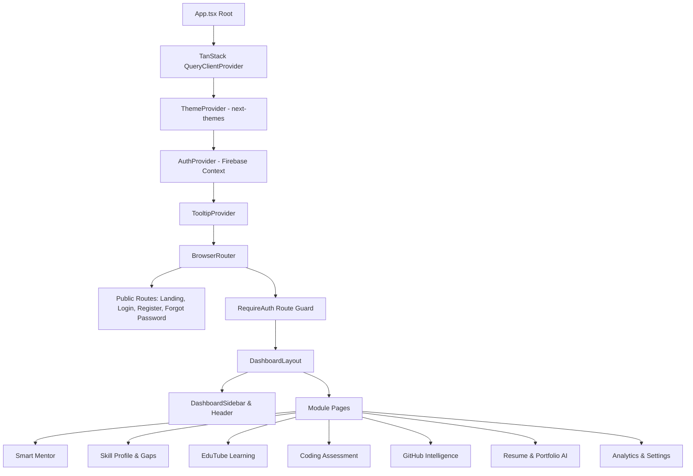
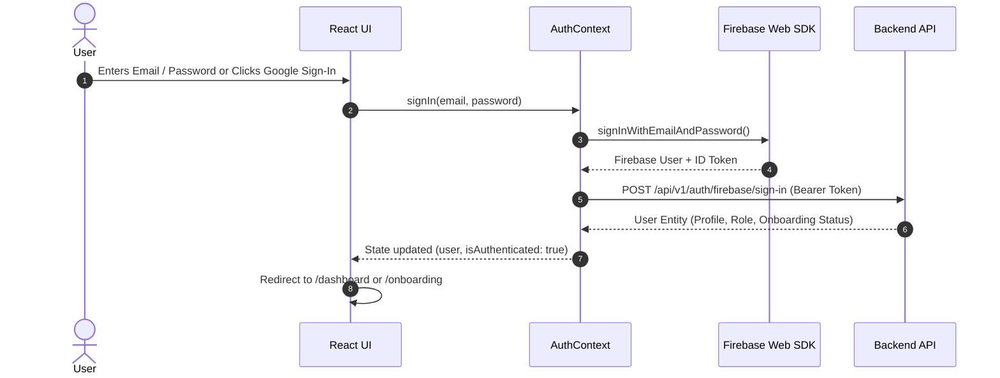

# Smart Skill Hub Frontend

> **React 18 + TypeScript + Vite Client Application for Smart Skill Hub**

[](https://react.dev/)
[](https://www.typescriptlang.org/)
[](https://vitejs.dev/)
[](https://tailwindcss.com/)
[](https://www.radix-ui.com/)
[](https://microsoft.github.io/monaco-editor/)

---

## 📑 Table of Contents
1. [Frontend Overview](#1-frontend-overview)
2. [Frontend Responsibilities](#2-frontend-responsibilities)
3. [UI/UX Design System](#3-uiux-design-system)
4. [Application Architecture](#4-application-architecture)
5. [Routing Architecture](#5-routing-architecture)
6. [Authentication Flow](#6-authentication-flow)
7. [Dashboard Architecture](#7-dashboard-architecture)
8. [Smart Mentor UI](#8-smart-mentor-ui)
9. [EduTube UI](#9-edutube-ui)
10. [GitHub Intelligence UI](#10-github-intelligence-ui)
11. [Skill Profile UI](#11-skill-profile-ui)
12. [Skill Gap UI](#12-skill-gap-ui)
13. [Learning Roadmap UI](#13-learning-roadmap-ui)
14. [Coding Assessment UI](#14-coding-assessment-ui)
15. [Resume AI UI](#15-resume-ai-ui)
16. [Portfolio UI](#16-portfolio-ui)
17. [Analytics UI](#17-analytics-ui)
18. [Profile Details](#18-profile-details)
19. [Settings & Integrations](#19-settings--integrations)
20. [API Communication](#20-api-communication)
21. [State Management](#21-state-management)
22. [Contexts / Hooks](#22-contexts--hooks)
23. [Reusable Components](#23-reusable-components)
24. [Module Architecture](#24-module-architecture)
25. [Error Handling](#25-error-handling)
26. [Loading States](#26-loading-states)
27. [Responsive Design](#27-responsive-design)
28. [Accessibility](#28-accessibility)
29. [Security Considerations](#29-security-considerations)
30. [Testing](#30-testing)
31. [Production Build](#31-production-build)
32. [Environment Configuration](#32-environment-configuration)
33. [Local Development](#33-local-development)
34. [Frontend Project Structure](#34-frontend-project-structure)

---

## 1. Frontend Overview

The **Smart Skill Hub Frontend** is an interactive, responsive Single Page Application (SPA) built using React 18, TypeScript, and Vite. It serves as the primary interface for users to manage their developer profile, analyze GitHub repositories, practice algorithmic challenges in Monaco Editor, watch skill-mapped educational videos, receive AI career mentorship, and design ATS-tailored resumes and portfolios.

For root system documentation, see [../README.md](../README.md).  
For backend API documentation, see [../backend/README.md](../backend/README.md).

---

## 2. Frontend Responsibilities

- **Interactive User Experience**: Providing fast, client-side routing, optimistic UI updates, and responsive layouts.
- **Client-Side Authentication**: Managing Firebase Auth sessions, acquiring signed RS256 ID tokens, and intercepting API calls to append bearer authentication.
- **Monaco Code Editing**: Delivering an algorithmic coding environment with syntax highlighting, indentation, and sample test evaluation.
- **Dynamic Visualizations**: Rendering skill gaps, repository metrics, and velocity charts with Recharts.
- **Resume Preview Workspace**: Providing an interactive A4 live document editor with font, margin, and color customization.

---

## 3. UI/UX Design System

The application combines clean modern typography with dark/light theme support:
- **Theme Provider**: Built on `next-themes` with seamless transitions between Light, Dark, and System modes.
- **Design Tokens**: Standardized CSS variables for background, foreground, border, card, popover, and primary brand accents (`src/styles/variables.css`, `src/styles/global.css`).
- **Typography**: Clean, readable sans-serif typography with high contrast ratios.
- **Feedback & Notifications**: Sonner and Radix UI Toast notifications for non-blocking feedback.

---

## 4. Application Architecture



---

## 5. Routing Architecture

Defined in `src/App.tsx` using `react-router-dom` (v6):

| Route Path | Component / Page | Access Control |
|---|---|---|
| `/` | `Landing.tsx` | Public |
| `/login` | `LoginPage.tsx` | Public (Redirects if authenticated) |
| `/register` | `RegisterPage.tsx` | Public |
| `/forgot-password` | `ForgotPasswordPage.tsx` | Public |
| `/verify-email` | `VerifyEmailPage.tsx` | Public |
| `/onboarding` | `OnboardingFlow.tsx` | Authenticated (`RequireAuth`) |
| `/dashboard` | `DashboardLayout.tsx` > `DashboardHome.tsx` | Authenticated |
| `/dashboard/mentor` | `SmartMentorPage.tsx` | Authenticated |
| `/dashboard/skills` | `SkillProfilePage.tsx` | Authenticated |
| `/dashboard/gaps` | `SkillGapsPage.tsx` | Authenticated |
| `/dashboard/roadmap` | `LearningRoadmapPage.tsx` | Authenticated |
| `/dashboard/edutube` | `EduTubePage.tsx` | Authenticated |
| `/dashboard/edutube/watch/:videoId` | `EduTubePage.tsx` | Authenticated |
| `/dashboard/edutube/history` | `HistoryPage.tsx` | Authenticated |
| `/dashboard/edutube/saved` | `SavedVideosPage.tsx` | Authenticated |
| `/dashboard/edutube/playlists` | `PlaylistsPage.tsx` | Authenticated |
| `/dashboard/edutube/playlists/:id` | `PlaylistDetailPage.tsx` | Authenticated |
| `/dashboard/coding` | `CodingAssessmentPage.tsx`| Authenticated |
| `/dashboard/github` | `GitHubIntelligencePage.tsx` | Authenticated |
| `/dashboard/resumes` | `Resumes.tsx` | Authenticated |
| `/dashboard/projects` | `Projects.tsx` | Authenticated |
| `/dashboard/portfolios` | `Portfolios.tsx` | Authenticated |
| `/dashboard/profile` | `ProfileDetailsPage.tsx` | Authenticated |
| `/dashboard/analytics` | `UserAnalyticsPage.tsx` | Authenticated |
| `/dashboard/settings` | `SettingsPage.tsx` | Authenticated |
| `/dashboard/admin/analytics` | `AdminAnalytics.tsx` | Authenticated (Admin role) |
| `*` | `NotFound.tsx` | Public 404 Fallback |

---

## 6. Authentication Flow



---

## 7. Dashboard Architecture

`DashboardLayout.tsx` wraps all protected views:
- **Sidebar Navigation**: `DashboardSidebar.tsx` dynamically highlights active links and collapses gracefully on mobile viewports.
- **Top Header**: Includes Quick Search, Theme Toggle, Smart Mentor shortcut, and User Profile Dropdown.
- **Outlet Content Area**: Scroll-contained view rendered inside a responsive main container.

---

## 8. Smart Mentor UI

Located in `src/modules/mentor/`:
- **Interactive Chat**: `MentorChat.tsx` and `MentorMessage.tsx` render conversational dialogue with rich markdown and code snippets.
- **Proactive Context Panel**: `MentorContextPanel.tsx` displays live candidate signals (Target Role, Readiness Score, Active Skill Gaps, and GitHub Repository health).
- **Action Cards**: `MentorActionCard.tsx` provides quick-click execution of recommended career actions.

---

## 9. EduTube UI

Located in `src/modules/edutube/`:
- **Search & Filters**: `EduTubeSearch.tsx` and `FilterBar.tsx` for searching topic-specific tutorials.
- **Video Cards & Grid**: `VideoGrid.tsx` and `VideoCard.tsx` displaying thumbnails, duration, channel name, and mapped skill badges.
- **Integrated Video Player**: `VideoPlayer.tsx` and `VideoNotes.tsx` for viewing lessons and taking synchronized learning notes.
- **Playlists & History**: Dedicated sub-pages for bookmarked items and custom learning tracks.

---

## 10. GitHub Intelligence UI

Located in `src/modules/github/`:
- **User Overview**: `UserOverview.tsx` presenting total repositories, stars, and contribution metrics.
- **Repo Analysis**: `RepoAnalysis.tsx` detailing complexity, velocity, and language distribution charts (`LanguageDistribution.tsx`).
- **Verified Evidence**: `SkillEvidence.tsx` presenting demonstrated technical skills extracted directly from commits.

---

## 11. Skill Profile UI

Located in `src/modules/skills/`:
- Displays verified skills grouped into categories (Frontend, Backend, Database, Cloud & DevOps, Core DSA).
- Color-coded skill tiers (`Beginner`, `Intermediate`, `Advanced`, `Expert`).
- Confidence breakdown displaying evidence sources.

---

## 12. Skill Gap UI

Located in `src/modules/gaps/`:
- Target role selector (e.g. Full Stack Developer, Backend Engineer, AI Engineer).
- Radar chart comparing the candidate's current capabilities against required benchmarks.
- Actionable gap items showing severity level (`High`, `Medium`, `Low`).

---

## 13. Learning Roadmap UI

Located in `src/modules/roadmap/`:
- Step-by-step visual milestone path.
- Direct links to EduTube video tutorials and sandboxed coding challenges.
- Checkbox progress tracking.

---

## 14. Coding Assessment UI

Located in `src/modules/coding/`:
- **Problem Statement**: Left pane with description, constraints, and sample test cases.
- **Monaco Code Editor**: Right pane with JavaScript language support, reset starter code, and theme synchronization.
- **Execution Output**: Bottom drawer showing test run results, runtime, stdout, and error traces.

---

## 15. Resume AI UI

Located in `src/modules/resume/`:
- **Multi-Section Builder**: `ResumeEditor.tsx`, `ExperienceSectionEditor.tsx`, `ProjectsSectionEditor.tsx`, `SkillsSectionEditor.tsx`.
- **Live A4 Preview Workspace**: `ResumeA4Preview.tsx` rendering pixel-accurate ATS-friendly layouts (`AtsClassicTemplate.tsx`, `ModernDeveloperTemplate.tsx`, `TwoColumnTemplate.tsx`).
- **AI Keyword Tailor**: `AiTailor.tsx` for pasting target job descriptions and calculating keyword match percentages.

---

## 16. Portfolio UI

Located in `src/modules/resume/Portfolios.tsx`:
- Visual portfolio theme picker.
- Live preview iframe with project and skill selectors.
- One-click deployment trigger to Cloudflare Pages.

---

## 17. Analytics UI

Located in `src/pages/UserAnalyticsPage.tsx` & `src/pages/AdminAnalytics.tsx`:
- **Personal Analytics**: Velocity trends, assessment success rate, and gap closure velocity.
- **Admin Analytics**: Total platform users, daily API hits, and module engagement charts.

---

## 18. Profile Details

Located in `src/pages/ProfileDetailsPage.tsx`:
- Master profile data viewer with editable contact information, headline, social links, education, and work history.

---

## 19. Settings & Integrations

Located in `src/pages/SettingsPage.tsx` and `src/modules/settings/`:
- Account management, connected GitHub accounts (`ConnectedAccountsSection.tsx`), theme preferences, and privacy controls.

---

## 20. API Communication

Client API calls are managed via centralized helper modules in `src/lib/api.ts` and domain APIs (`src/modules/*/services/*.api.ts`):
- Uses native `fetch` with an automatic `Authorization: Bearer <token>` injection interceptor.
- Unifies response parsing and throws structured `ApiError` instances on HTTP errors.

---

## 21. State Management

- **Global Auth State**: React Context (`AuthContext.tsx`) storing user credentials, role, and loading state.
- **Server Cache & Async State**: `@tanstack/react-query` configured with a 5-minute stale-time window and background revalidation.
- **Local Component State**: React `useState` and `useReducer` for UI controls, modal open states, and form inputs.

---

## 22. Contexts / Hooks

| Hook / Context | File | Purpose |
|---|---|---|
| `useAuth()` | `src/contexts/use-auth.ts` | Access current user, login, logout, and token state |
| `AuthProvider` | `src/core/auth/AuthContext.tsx` | Firebase Auth lifecycle listener |
| `useTheme()` | `src/components/theme-provider.tsx` | Theme toggle (Light / Dark / System) |
| `useToast()` | `src/components/ui/use-toast.ts` | Programmatic toast notification trigger |

---

## 23. Reusable Components

All accessible UI primitives live in `src/components/ui/`:
- `Button`, `Input`, `Textarea`, `Card`, `Badge`, `Dialog`, `DropdownMenu`, `Tabs`, `Table`, `Select`, `Slider`, `Switch`, `Tooltip`, `Progress`, `ScrollArea`, `Sheet`, `Accordion`.

---

## 24. Module Architecture

The frontend follows a domain-driven module structure:
```text
src/modules/
├── coding/           # Coding assessment pages & Monaco runner
├── dashboard/        # Main dashboard home & metrics
├── edutube/          # Video curation, player, notes, playlists
├── gaps/             # Skill gap charts and role benchmarks
├── github/           # GitHub repository insights & evidence
├── mentor/           # Smart Mentor chat & context panel
├── profile/          # Profile API & data adapters
├── recommendations/  # Roadmap recommendation views
├── resume/           # Resume builder, A4 preview, AI tailor, portfolios
├── roadmap/          # Milestone learning roadmaps
├── settings/         # User settings & GitHub integration sections
└── skills/           # Canonical skill profile view
```

---

## 25. Error Handling

- **Error Boundaries**: Catch unexpected React render crashes and display fallback screens.
- **Toast Alerts**: Display user-friendly error messages on failed API requests.
- **Form Validation**: `react-hook-form` paired with `zod` schemas to prevent invalid input submissions.

---

## 26. Loading States

- Skeleton loaders (`src/components/ui/skeleton.tsx`) displayed while fetching queries.
- Action button spinners (`lucide-react` `<Loader2 className="animate-spin" />`) during async mutations.

---

## 27. Responsive Design

- Built with Tailwind CSS media query breakpoints (`sm:`, `md:`, `lg:`, `xl:`).
- Collapsible sidebar that transforms into a mobile slide-out drawer on narrow screens.
- Responsive grid layouts for video cards, metrics, and template thumbnails.

---

## 28. Accessibility

- Built using **Radix UI** primitives providing WAI-ARIA compliance.
- Keyboard accessible navigation across modals, dropdowns, and tab panels.
- Semantic HTML tags (`<header>`, `<main>`, `<nav>`, `<section>`, `<article>`).

---

## 29. Security Considerations

- No hardcoded private API keys or OAuth secrets in frontend source files.
- All backend requests pass through the Firebase JWT authorization header.
- User input sanitized before DOM rendering to prevent XSS.

---

## 30. Testing

The frontend utilizes **Vitest**, **React Testing Library**, and **JSDOM**:
```bash
# Run all frontend tests
npm test

# Run tests in watch mode
npm run test:watch
```

---

## 31. Production Build

```bash
# Generate optimized production bundle in dist/
npm run build

# Preview the production build locally
npm run preview
```

---

## 32. Environment Configuration

Copy `frontend/.env.example` to `frontend/.env` before starting development:

| Variable | Description | Example |
|---|---|---|
| `VITE_API_URL` | Backend REST API endpoint | `http://localhost:8000/api/v1` |
| `VITE_FIREBASE_API_KEY` | Firebase Web API Key | `your_firebase_api_key` |
| `VITE_FIREBASE_AUTH_DOMAIN`| Firebase Auth Domain | `smart-skill-hub.firebaseapp.com` |
| `VITE_FIREBASE_PROJECT_ID` | Firebase Project ID | `smart-skill-hub` |
| `VITE_FIREBASE_MESSAGING_SENDER_ID` | FCM Sender ID | `your_sender_id` |
| `VITE_FIREBASE_APP_ID` | Firebase Web App ID | `your_app_id` |
| `VITE_FIREBASE_MEASUREMENT_ID` | Firebase Measurement ID | `your_measurement_id` |

---

## 33. Local Development

```bash
cd frontend
npm install
cp .env.example .env
npm run dev
```
Open `http://localhost:5173` in your browser.

---

## 34. Frontend Project Structure

```text
frontend/
├── src/
│   ├── components/       # Shared UI primitives & navigation
│   │   ├── ui/           # Radix UI + Tailwind primitive components
│   │   ├── landing/      # Landing page sections & features
│   │   ├── resume/       # Resume previewers
│   │   ├── DashboardSidebar.tsx
│   │   ├── RequireAuth.tsx
│   │   └── theme-provider.tsx
│   ├── core/             # Authentication & API core services
│   ├── contexts/         # React Context definitions
│   ├── lib/              # Utility functions & API client
│   ├── modules/          # Domain-specific feature modules
│   ├── pages/            # Top-level page routes
│   ├── styles/           # CSS design tokens and globals
│   ├── test/             # Vitest test suites
│   ├── App.tsx           # Application router
│   ├── main.tsx          # Entry point
│   └── vite-env.d.ts
├── index.html
├── package.json
├── tailwind.config.ts
├── tsconfig.json
├── vite.config.ts
├── vitest.config.ts
└── README.md
```
